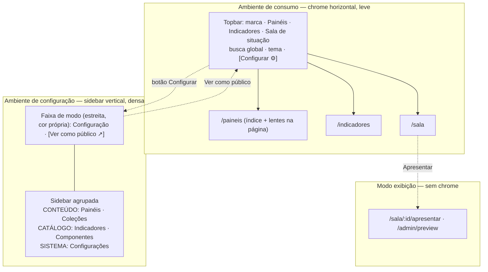

# Plano — Reorganização da Navegação (consumo × configuração)

> **Status:** implementado (nav "Indicadores" removida do consumo e "Catálogo" do admin junto com o
> corte do MVP — ver [`README.md`](../README.md)) · **Data:** 2026-08-05
> **Escopo:** arquitetura de navegação e chrome das duas áreas da aplicação — ambiente de consumo (`/`) e ambiente de configuração (`/admin`). Não altera renderização de painéis, schemas, stores nem provider de dados.

---

## 1. Diagnóstico

As duas áreas hoje usam **o mesmo padrão de chrome**: uma barra superior horizontal com marca à esquerda e uma fileira plana de links. O CSS é praticamente duplicado — `Header.module.css:61-96` e `AdminLayout.module.css:61-96` têm as mesmas regras `.header/.inner/.brand/.nav/.navLink`. O resultado é que a única pista de que se mudou de ambiente é o texto da marca e a faixa `Ambiente de configuração` (`AdminLayout.tsx:10-19`).

| Problema                                          | Evidência                                                                                                                                                                                       | Consequência                                                                                                                      |
| ------------------------------------------------- | ----------------------------------------------------------------------------------------------------------------------------------------------------------------------------------------------- | --------------------------------------------------------------------------------------------------------------------------------- |
| **Menus quase idênticos**                         | Consumo: Início · Painéis · Indicadores · Sala de situação · Configuração (`Header.tsx:21-37`). Admin: Painéis · Indicadores · Componentes · Coleções · Configurações (`AdminLayout.tsx:25-41`) | "Painéis" e "Indicadores" aparecem nos dois lados com significados diferentes (ver × administrar) e visual igual                  |
| **Sem estado ativo em lugar nenhum**              | `grep NavLink\|aria-current` não encontra nenhuma ocorrência de navegação: ambos usam `<Link>` puro                                                                                             | O usuário nunca sabe em que seção está; falha de acessibilidade (sem `aria-current="page"`)                                       |
| **Troca de ambiente como item de menu**           | `Configuração` é o 5º link do nav público, irmão de Painéis/Indicadores                                                                                                                         | Uma mudança de **modo** disfarçada de destino de conteúdo; a volta (`Sair do modo de configuração`) fica na faixa, em outro lugar |
| **Admin plano, com itens de naturezas distintas** | 5 links irmãos: conteúdo editável (Painéis, Coleções), catálogo/referência (Indicadores, Componentes), sistema (Configurações)                                                                  | Tudo com o mesmo peso; a Galeria de componentes (referência de dev) parece uma área de gestão                                     |
| **Breadcrumb redundante**                         | Presente em 16 páginas, inclusive de profundidade 1 (`CatalogPage.tsx:34`, `CollectionsPage.tsx:15`) e sempre reancorado em `Início` mesmo dentro do admin (`AdminPanelsPage.tsx:91-97`)        | Duas navegações dizendo a mesma coisa; no admin o breadcrumb sai do ambiente ("Início / Admin / Painéis")                         |
| **`/admin` index é a lista de painéis**           | `router.tsx:42` (`index: true` → `AdminPanelsPage`)                                                                                                                                             | Rota sem URL própria: não dá para linkar "lista de painéis" nem marcar o item ativo sem caso especial                             |
| **Sem responsivo**                                | `.nav { display: flex; gap }` sem colapso nem menu móvel nos dois shells                                                                                                                        | Em telas estreitas os links espremem/estouram                                                                                     |
| **Conceito de "lente" não chega ao menu**         | A Home explica que existe um índice único navegado por lentes (`HomePage.tsx:55-60`, `config/lenses.ts`)                                                                                        | O nav contradiz o modelo: oferece destinos planos e não expõe as lentes onde a navegação de fato acontece                         |

**Resumo:** o problema não é estética de barra — é que a navegação não expressa o modelo mental do produto. Consumir é _explorar um acervo_; configurar é _operar uma ferramenta_. São tarefas de naturezas opostas recebendo o mesmo chrome.

---

## 2. Princípios da proposta

1. **Ambiente se reconhece em 200 ms.** Consumo e configuração devem diferir em _estrutura_ (topo × lateral), não só em cor ou rótulo.
2. **Navegar ≠ trocar de modo.** Ir para o admin é mudar de ferramenta; sai do nav e vira um controle explícito de modo, com caminho de volta simétrico.
3. **Um nível de navegação por vez.** Nav global diz _onde estou_; a segmentação fina (lentes, filtros, abas) mora na página, não no topo.
4. **Estado ativo obrigatório.** `NavLink` + `aria-current` em toda navegação, sem exceção.
5. **Agrupar por natureza no admin**, porque a lista cresce (hoje 5 itens, com backend virão usuários, permissões, fontes de dados, auditoria).
6. **Breadcrumb só onde há profundidade real** (≥ 2 níveis) e sempre ancorado na raiz do próprio ambiente.

---

## 3. Proposta



### 3.1 Ambiente de consumo — topbar enxuta

```
┌──────────────────────────────────────────────────────────────────────────────┐
│  ▣ Painel de Governo   Painéis   Indicadores   Sala de situação              │
│                         ▔▔▔▔▔▔▔                                              │
│                                        [ 🔍 Buscar painéis…]  ◐  [⚙ Configurar]│
└──────────────────────────────────────────────────────────────────────────────┘
```

Mudanças em relação ao atual:

- **"Início" sai do nav.** A marca já é o link para `/` — dois caminhos para a mesma coisa gastam um slot. Restam **3 destinos**, um por natureza de conteúdo: painéis (o produto), indicadores (a matéria-prima), sala de situação (o modo de exibição).
- **"Configuração" sai do nav** e vira botão à direita, separado por um divisor, alinhado com o toggle de tema — é controle de aplicação, não destino de conteúdo.
- **Busca global sobe para o topo.** Hoje o campo de busca vive dentro do hero da Home (`HomePage.tsx:27-36`) e some nas outras páginas. No topo, ela funciona de qualquer lugar e passa a ser o atalho principal — coerente com "índice único".
- **Estado ativo** com sublinhado + cor de marca + `aria-current="page"`; ativo por prefixo de rota (`/paineis/:id` mantém "Painéis" aceso).
- **Lentes ficam na página**, como já estão (Home e Catálogo) — não sobem para o menu. Isso preserva a decisão de `config/lenses.ts` de que lente é recorte, não árvore.
- **Responsivo:** abaixo de 720 px, os 3 destinos viram uma barra inferior de ícones+rótulo ou um menu "☰"; a busca vira ícone que expande.

### 3.2 Ambiente de configuração — sidebar agrupada

```
┌───────────────────────────────────────────────────────────────────────────────┐
│ ⚙ CONFIGURAÇÃO · alterações afetam os painéis publicados   [Ver como público ↗]│  ← faixa 32px, cor própria
├───────────────────┬───────────────────────────────────────────────────────────┤
│ ▣ Painel de       │                                                           │
│   Governo         │   Painéis                                    [+ Novo ▾]   │
│                   │   Crie, edite e publique painéis.                         │
│ CONTEÚDO          │   ─────────────────────────────────────────────────────   │
│ ▸ Painéis      12 │   ▸ Emprego e renda            Modificado      Editar ⋯   │
│ ▸ Coleções      3 │   ▸ Demografia                 Original       Editar ⋯    │
│                   │   ▸ Painel Power BI externo    Novo           Editar ⋯    │
│ CATÁLOGO          │                                                           │
│ ▸ Indicadores  10 │                                                           │
│ ▸ Componentes     │                                                           │
│                   │                                                           │
│ SISTEMA           │                                                           │
│ ▸ Configurações   │                                                           │
└───────────────────┴───────────────────────────────────────────────────────────┘
```

- **Sidebar vertical fixa** (240 px, colapsável para 64 px em ícones). É a diferença estrutural que torna os dois ambientes irreconhecíveis um pelo outro à distância.
- **Três grupos com rótulo**, refletindo natureza e não frequência:
  - **Conteúdo** — o que é criado e publicado: Painéis, Coleções.
  - **Catálogo** — o que se consulta para configurar: Indicadores (leitura + uso), Componentes (galeria de referência).
  - **Sistema** — Configurações (domínios de embed permitidos e o que vier depois).
- **Contadores** ao lado dos itens de conteúdo (12 painéis, 3 coleções) — informação que a lista já tem e que economiza um clique.
- **A faixa de ambiente encolhe** de bloco de 3 linhas para uma faixa de ~32 px com o aviso resumido; o texto completo ("sem autenticação nesta versão", "alterações afetam imediatamente") migra para um `title`/popover no ícone ⚠. O aviso longo atual repete a mesma informação em toda página e vira ruído.
- **"Sair do modo de configuração" vira "Ver como público ↗"**, na faixa, à direita — simétrico ao botão `⚙ Configurar` do consumo. Abre a rota pública correspondente quando existir (editando `/admin/paineis/emprego` → `/paineis/emprego`).
- **Densidade maior**: fonte e espaçamentos um passo abaixo do consumo. Ferramenta é para trabalhar, não para contemplar.

### 3.3 Modo exibição — sem chrome

`/sala/:id/apresentar` e `/admin/preview` já ficam fora dos dois shells (`router.tsx:53-60`). Isso passa a ser regra explícita e documentada: **layout de exibição = zero chrome**, saída por `Esc`.

---

## 4. Mudanças de rota

| Hoje                                              | Proposto                                  | Motivo                                                                                          |
| ------------------------------------------------- | ----------------------------------------- | ----------------------------------------------------------------------------------------------- |
| `/admin` (index → `AdminPanelsPage`)              | `/admin` → redirect para `/admin/paineis` | URL própria para a lista; item ativo sem caso especial; abre espaço para uma futura visão geral |
| `/admin/colecoes`, `/admin/paineis`, …            | inalterados                               | —                                                                                               |
| `/dev/galeria` → `/admin/componentes`             | inalterado                                | —                                                                                               |
| Público: `/`, `/paineis`, `/indicadores`, `/sala` | inalterados                               | Nenhuma URL pública quebra                                                                      |

**Nenhum link externo quebra** — a única mudança é um redirect adicional.

---

## 5. Impacto no código

### 5.1 Componentes novos (`src/components/nav/`)

| Arquivo            | Responsabilidade                                                                                                                    |
| ------------------ | ----------------------------------------------------------------------------------------------------------------------------------- |
| `navItems.ts`      | Fonte única dos itens de cada ambiente: `{ id, label, to, match, group? }`. Hoje os rótulos estão hard-coded em dois JSX diferentes |
| `NavItem.tsx`      | `NavLink` + estado ativo por prefixo + `aria-current` — usado pelo topo e pela sidebar                                              |
| `ModeSwitch.tsx`   | Botão `⚙ Configurar` / `Ver como público ↗`, com mapeamento de rota equivalente entre ambientes                                     |
| `GlobalSearch.tsx` | Busca no topo (extraída do hero da Home), navegando para `/paineis?q=…`                                                             |

### 5.2 Arquivos alterados

| Arquivo                                                                   | Mudança                                                                                                      |
| ------------------------------------------------------------------------- | ------------------------------------------------------------------------------------------------------------ |
| `src/components/layout/Header.tsx`                                        | 3 destinos + `NavItem` + busca + `ModeSwitch`; remove link "Configuração" e "Início"                         |
| `src/components/layout/Header.module.css`                                 | Divisor à direita, estado ativo, breakpoint móvel                                                            |
| `src/admin/AdminLayout.tsx`                                               | Grid `faixa / sidebar + conteúdo`; nav vertical agrupada; faixa reduzida                                     |
| `src/admin/AdminLayout.module.css`                                        | Reescrito para sidebar (deixa de duplicar `Header.module.css`)                                               |
| `src/app/pages/HomePage.tsx`                                              | Remove o campo de busca do hero (subiu para o topo)                                                          |
| `src/app/router.tsx`                                                      | `/admin` → `<Navigate to="/admin/paineis" replace />` + rota `paineis` explícita                             |
| 16 páginas com `<Breadcrumb>`                                             | Remover nas de profundidade 1; nas de profundidade ≥ 2 do admin, ancorar em "Configuração" (não em "Início") |
| `AdminLayout.test.tsx`, `admin.integration.test.tsx`, `HomePage.test.tsx` | Ajuste das asserções de nav/busca                                                                            |

### 5.3 O que **não** muda

`ConfigRenderer`, `ComponentRegistry`, stores, provider, schemas, páginas de painel, kiosk player, tokens de tema.

---

## 6. Etapas de implementação

### Etapa 1 — Fundação de navegação

- [ ] `navItems.ts` com os dois conjuntos de itens (consumo e configuração, este com grupos).
- [ ] `NavItem` com `NavLink`, match por prefixo e `aria-current`.
- [ ] Aplicar `NavItem` nos dois shells **sem mudar layout ainda** — ganho isolado e testável: estado ativo passa a existir.

### Etapa 2 — Topbar de consumo

- [ ] Remover "Início" e "Configuração" do nav; incluir `ModeSwitch` à direita.
- [ ] `GlobalSearch` no topo; remover o campo do hero da Home; `/paineis?q=` passa a ser a rota de resultado.
- [ ] Breakpoint móvel (menu colapsado).

### Etapa 3 — Sidebar de configuração

- [ ] Reescrever `AdminLayout` como grid com sidebar agrupada + contadores.
- [ ] Reduzir a faixa de ambiente; aviso completo em popover.
- [ ] `Ver como público ↗` com mapeamento de rota equivalente.
- [ ] Colapso da sidebar (persistido em `localStorage`).

### Etapa 4 — Rotas e breadcrumb

- [ ] `/admin` → redirect; rota `paineis` explícita.
- [ ] Remover breadcrumbs de profundidade 1; reancorar os do admin.
- [ ] Atualizar testes e a seção de navegação do README.

_Cada etapa entrega valor sozinha e termina com testes verdes. A Etapa 1 já resolve a queixa mais objetiva (não se sabe onde se está); as Etapas 2 e 3 resolvem a semelhança visual entre os ambientes._

---

## 7. Acessibilidade e responsivo

- `aria-current="page"` no item ativo; `<nav aria-label>` distinto por ambiente ("Navegação principal" / "Navegação de configuração").
- Skip link preservado nos dois shells; no admin ele deve pular a sidebar, não só a faixa.
- Foco visível em todos os itens de nav (hoje só há `:hover`).
- Alvos de toque ≥ 44 px na versão móvel.
- Sidebar colapsada mantém rótulo acessível (`aria-label`) mesmo exibindo só ícone.
- Contraste da faixa de configuração validado em tema claro e escuro (`--pg-color-brandSoft` já é usado; a faixa nova precisa de checagem em dark).

---

## 8. Riscos e pontos de atenção

| Risco                                                                     | Mitigação                                                                                       |
| ------------------------------------------------------------------------- | ----------------------------------------------------------------------------------------------- |
| Tirar "Início" do nav pode desorientar quem espera o link                 | Marca é link para `/` com `title="Início"`; padrão consolidado em produtos web                  |
| Busca global exige que `/paineis` aceite `?q=`                            | Já há filtro por título/tema/tags na Home; mover a lógica para o Catálogo é reaproveitamento    |
| Sidebar consome largura no editor de painel (que já é split form+preview) | Sidebar colapsável, com colapso automático nas rotas de editor                                  |
| Contadores na sidebar leem os stores a cada render                        | Stores são síncronos sobre `localStorage`; se pesar, calcular no layout e passar por contexto   |
| Remover breadcrumbs pode quebrar testes de página                         | Etapa 4 isolada, com ajuste de asserções no mesmo commit                                        |
| Divergência entre `ModeSwitch` e rotas equivalentes                       | Mapa explícito em `navItems.ts`; fallback para a raiz do ambiente quando não houver equivalente |

---

## 9. Fora de escopo

- Autenticação e menu de conta/usuário (virá com o backend; o slot à direita do topo já fica reservado).
- Busca com índice ou full-text — a busca global da v1 filtra o mesmo conjunto que a Home filtra hoje.
- Menu de favoritos/recentes.
- Redesenho das páginas em si (cards, listas, editor) — este plano trata só de chrome e navegação.
- Novos tokens de design ou mudança de identidade visual.
