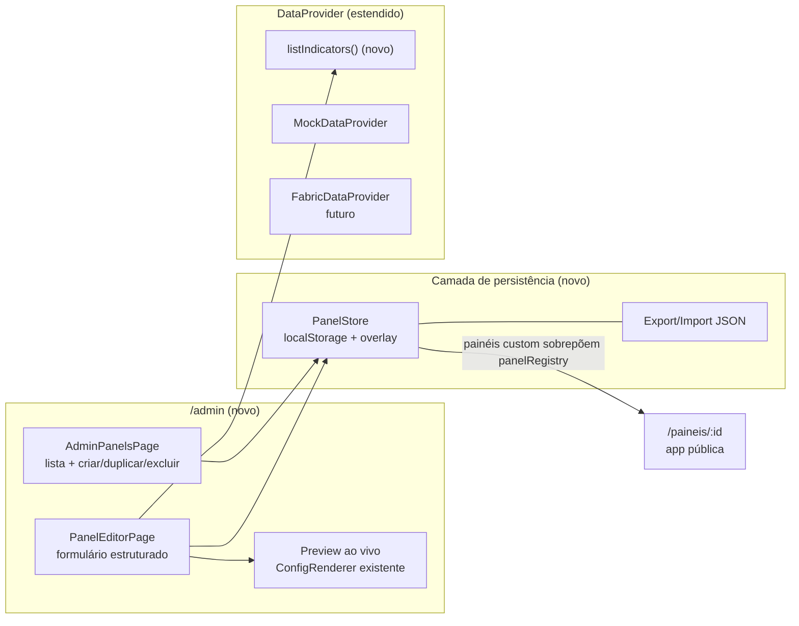

# Plano — Ambiente de Configuração de Painéis

> **Status:** aprovado para implementação · **Data:** 2026-08-04
> **Escopo:** editor administrativo para criar e editar páginas (painéis) atribuindo tipo de componente + indicador, com dados mock e caminho de migração para Fabric via API.

> **Enquadramento da validação:** este plano implementa uma prova do conceito operacional — índice
> único navegado por lentes e criação/edição/publicação local de painéis com componentes fixos e
> regras de posicionamento. “Publicar”, nesta fase, significa disponibilizar imediatamente o painel
> salvo na área pública da mesma aplicação e do mesmo navegador. Ver
> [`escopo-do-prototipo.md`](escopo-do-prototipo.md) para critérios de sucesso e itens fora de escopo.

---

## 1. Decisões confirmadas

| Tema                     | Decisão                                                                                               |
| ------------------------ | ----------------------------------------------------------------------------------------------------- |
| Persistência (fase mock) | `localStorage` + exportar/importar JSON (o JSON exportado pode ser commitado em `src/config/panels/`) |
| Escopo de edição         | Tipo de componente + indicador, seções/layouts, filtros do painel, metadados do painel                |
| Acesso                   | Rota `/admin` na mesma aplicação, sem autenticação por enquanto                                       |
| Experiência de edição    | Formulário estruturado à esquerda + preview ao vivo à direita (reutilizando o `ConfigRenderer`)       |
| Catálogo de indicadores  | Novo método `listIndicators()` no `DataProvider` (mock agora, Fabric depois)                          |
| Publicação/versionamento | Fora da v1 — salvar direto; estados rascunho/publicado virão com o backend                            |

---

## 2. Ponto de partida (arquitetura atual)

A aplicação já é **config-driven**, o que reduz drasticamente o esforço:

- **Schema validado com Zod** — `src/config/schemas/panel.schema.ts` define `PanelConfig` (metadados, filtros, seções com layout `grid-2|grid-3|grid-4|stack`, componentes em discriminated union).
- **4 tipos de componente registrados** — `indicator-card`, `time-series`, `bar-chart`, `data-table` em `src/renderer/ComponentRegistry.tsx`.
- **Renderização por configuração** — `ConfigRenderer` valida e renderiza qualquer `PanelConfig`; é exatamente o motor do preview ao vivo.
- **Provider plugável** — interface `DataProvider` (`src/data/provider.ts`) com `MockDataProvider`; a troca por um `FabricDataProvider` é 1 linha em `main.tsx`.
- **Painéis estáticos** — hoje registrados em `src/config/panels/index.ts` (`panelRegistry`).

O ambiente de configuração é, essencialmente, **um formulário que produz objetos `PanelConfig` válidos** — nenhuma mudança no motor de renderização é necessária.

---

## 3. Arquitetura proposta



### 3.1 `PanelStore` — persistência com overlay

Camada que unifica painéis estáticos (código) e painéis editados (localStorage):

```
Leitura:  localStorage["admin.panels"] ∪ panelRegistry   (localStorage tem precedência por id)
Escrita:  sempre em localStorage (painéis estáticos nunca são mutados no código)
```

- Painel estático editado → cópia salva no localStorage passa a "sombrear" o original (com indicação visual de _modificado_ e ação _restaurar original_).
- Painel novo → existe só no localStorage até ser exportado.
- O `MockDataProvider.listPanels()` / `getPanelConfig()` passam a consultar o `PanelStore`, para que a app pública (`/paineis/:id`, catálogo) reflita imediatamente as edições.
- Toda escrita passa por `panelConfigSchema.parse()` — configuração inválida nunca é persistida.

**Export/Import:**

- _Exportar_: download de `<id>.panel.json` (ou cópia para clipboard). Para oficializar, o dev converte em `<id>.panel.ts` e registra em `src/config/panels/index.ts` (podemos aceitar `.json` direto no registry para eliminar esse passo).
- _Importar_: upload de JSON → validação Zod → salva no store (com diálogo de conflito se o `id` já existir).

### 3.2 Catálogo de indicadores — `listIndicators()`

Novo tipo e método na interface `DataProvider`:

```ts
export type IndicatorSummary = {
  id: string; // ex.: "populacao_total"
  name: string; // ex.: "População total"
  unit: string;
  source: string;
  /** Formas de dado que o indicador oferece — determina os tipos de componente compatíveis */
  shapes: Array<"metric" | "categorical" | "table">;
  /** Dimensões disponíveis para quebra (ex.: "sexo", "setor") — alimenta bar-chart/time-series */
  dimensions?: string[];
  /** Datasets tabulares associados (para data-table) */
  datasets?: string[];
  defaultFormat?: FormatType;
};

interface DataProvider {
  // ... métodos existentes
  listIndicators(): Promise<IndicatorSummary[]>;
}
```

**Implementação mock:** um fixture `src/data/mock/datasets/indicators.json` (gerado/mantido junto aos demais em `scripts/generate-mock-fixtures.mjs`), derivado dos fixtures existentes em `metrics/`, `categorical/` e `tables/`.

**Regra de compatibilidade no editor** (evita configuração impossível):

| Tipo de componente | Requisito do indicador                                                     |
| ------------------ | -------------------------------------------------------------------------- |
| `indicator-card`   | `shapes` contém `metric`                                                   |
| `time-series`      | `shapes` contém `metric`                                                   |
| `bar-chart`        | `shapes` contém `categorical` (dimensão obrigatória vinda de `dimensions`) |
| `data-table`       | `shapes` contém `table` (dataset escolhido de `datasets`)                  |

O dropdown de indicadores filtra por compatibilidade com o tipo escolhido — ou, inversamente, escolhido o indicador, só os tipos compatíveis ficam habilitados.

**Migração Fabric:** `listIndicators()` no `FabricDataProvider` consumirá o endpoint do backend/Fabric que devolve o catálogo de indicadores prontos. O contrato `IndicatorSummary` é o acordo de API a alinhar com o time de dados.

### 3.2.1 Frescor do painel — `getPanelFreshness()` (adendo — 2026-08-05)

Decisão: período de referência e data de atualização deixam de ser campos editáveis do painel e
passam a ser resolvidos pelo `DataProvider`, não persistidos em `PanelConfig`.

```ts
export type PanelFreshness = {
  referencePeriod?: string;
  updatedAt?: string;
};

interface DataProvider {
  // ... métodos existentes
  getPanelFreshness(panelId: string): Promise<PanelFreshness>;
}
```

- `panelMetadataSchema` perdeu os campos `referencePeriod`/`updatedAt`; ficam apenas `source`,
  `owner`, `methodologyNote`.
- `PanelMetadataForm` não expõe mais esses campos — não são responsabilidade de quem edita o
  painel.
- **Implementação mock:** `src/data/mock/datasets/freshness/<panelId>.json`, consumido por
  `MockDataProvider.getPanelFreshness()` e por `listPanels()` (preenche `PanelSummary.updatedAt`).
- **Migração Fabric:** o `FabricDataProvider` resolve `getPanelFreshness()` a partir do schema de
  tabelas de monitoramento de atualização do Fabric, que dispara automaticamente quando há dado
  novo — sem intervenção manual no cadastro do painel.

### 3.3 Rotas e páginas novas

```ts
// src/app/router.tsx — acréscimos
{ path: "admin", element: <AdminLayout /> , children: [
  { index: true, element: <AdminPanelsPage /> },          // lista de painéis
  { path: "paineis/novo", element: <PanelEditorPage /> }, // criação
  { path: "paineis/:id", element: <PanelEditorPage /> },  // edição
]}
```

| Página            | Responsabilidade                                                                                                                                                            |
| ----------------- | --------------------------------------------------------------------------------------------------------------------------------------------------------------------------- |
| `AdminPanelsPage` | Lista todos os painéis (estáticos + custom) com badges _original / modificado / novo_; ações: editar, duplicar, excluir (só custom), restaurar original, exportar, importar |
| `PanelEditorPage` | Editor split: formulário (esquerda) + preview ao vivo (direita)                                                                                                             |

### 3.4 Editor — estrutura do formulário

Organização em blocos colapsáveis espelhando o schema:

1. **Metadados** — id (slug, imutável após criação), título, descrição, tema, tags, fonte, responsável, nota metodológica. Período de referência e data de atualização **não** são campos do formulário — vêm do `DataProvider` (`getPanelFreshness`), que no backend Fabric é alimentado pela tabela de monitoramento de atualizações (ver adendo no fim deste documento).
2. **Filtros** — lista ordenável; cada item: tipo (`single-select` | `multi-select` | `period`), label, `dataField`.
3. **Seções** — lista ordenável; cada seção: título, layout (`grid-2|3|4|stack`) e seus **componentes**:
   - Tipo (dropdown com os tipos do `componentRegistry`);
   - Indicador (dropdown alimentado por `listIndicators()`, filtrado por compatibilidade);
   - Campos condicionais por tipo (título, formato; orientação/ordenação para bar-chart; comparação para card; colunas/limite para tabela — colunas pré-preenchidas a partir do dataset escolhido);
   - Ações: duplicar, remover, mover ↑↓.

**Estado do editor:** `useReducer` com o draft de `PanelConfig` + validação Zod contínua (erros exibidos por campo via `issue.path`). Sem biblioteca de formulário na v1 — o schema Zod já existe e o formulário é estruturado, não dinâmico.

**Preview ao vivo:** `<ConfigRenderer panelId={draft.id} config={draft} />` renderizado com o draft atual (debounce ~300 ms). Como o `ConfigRenderer` já trata config inválida com `ErrorState` detalhado, o preview também serve de feedback de validação. Componentes que referenciam indicador sem fixture caem no `AsyncBoundary`/`ErrorState` naturalmente.

### 3.5 O que **não** muda

- `ConfigRenderer`, `ComponentRegistry`, containers, hooks de dados, componentes de gráfico — intocados.
- Schemas Zod — apenas reutilizados (fonte única de verdade do editor).
- Páginas públicas — só passam a enxergar painéis do `PanelStore` via provider.

---

## 4. Estrutura de arquivos prevista

```
src/
├── admin/                          # tudo do ambiente de configuração isolado aqui
│   ├── AdminLayout.tsx             # shell do admin (header próprio, aviso "ambiente de configuração")
│   ├── pages/
│   │   ├── AdminPanelsPage.tsx
│   │   └── PanelEditorPage.tsx
│   ├── editor/
│   │   ├── PanelMetadataForm.tsx
│   │   ├── FiltersForm.tsx
│   │   ├── SectionsForm.tsx
│   │   ├── ComponentForm.tsx       # campos condicionais por tipo
│   │   ├── IndicatorSelect.tsx     # dropdown com busca + filtro de compatibilidade
│   │   ├── EditorPreview.tsx       # wrapper do ConfigRenderer com debounce
│   │   └── editorReducer.ts        # estado do draft + ações
│   └── store/
│       ├── PanelStore.ts           # overlay localStorage ∪ panelRegistry
│       └── exportImport.ts         # serialização, download, upload, validação
├── data/
│   ├── provider.ts                 # + listIndicators(): Promise<IndicatorSummary[]>
│   └── mock/
│       ├── MockDataProvider.ts     # + listIndicators; listPanels/getPanelConfig via PanelStore
│       └── datasets/indicators.json
└── app/router.tsx                  # + rotas /admin
```

---

## 5. Etapas de implementação

### Etapa 1 — Fundações de dados

- [ ] Tipo `IndicatorSummary` + `listIndicators()` na interface `DataProvider`.
- [ ] Fixture `indicators.json` (derivado dos fixtures atuais) + implementação no `MockDataProvider`.
- [ ] Hook `useIndicatorList()` seguindo o padrão dos hooks existentes.
- [ ] `PanelStore` (overlay localStorage) + integração em `listPanels`/`getPanelConfig`.
- [ ] Testes: overlay (precedência, restaurar original), validação na escrita, provider-swap continua verde.

### Etapa 2 — Shell do admin e lista de painéis

- [ ] Rotas `/admin`, `AdminLayout` (indicação clara de ambiente de configuração).
- [ ] `AdminPanelsPage`: listagem com badges de origem, criar, duplicar, excluir, restaurar.
- [ ] Export (download JSON) e import (upload + validação + conflito de id).

### Etapa 3 — Editor: metadados, filtros e seções

- [ ] `editorReducer` + validação Zod contínua com erros por campo.
- [ ] `PanelMetadataForm`, `FiltersForm`, `SectionsForm` (adicionar/remover/reordenar).
- [ ] Salvar no `PanelStore` (bloqueado se schema inválido).

### Etapa 4 — Editor de componentes + indicadores

- [ ] `ComponentForm` com campos condicionais por tipo.
- [ ] `IndicatorSelect` com busca e filtro de compatibilidade tipo ↔ indicador.
- [ ] Pré-preenchimento de colunas de tabela a partir do dataset.

### Etapa 5 — Preview ao vivo e polimento

- [x] `EditorPreview` (split view, debounce, estado de "config inválida").
- [x] Confirmações destrutivas (excluir, restaurar, sair sem salvar).
- [x] Testes de integração: criar painel do zero → salvar → renderizar em `/paineis/:id`; editar estático → sombrear → restaurar.
- [x] Atualização do README (seção "Ambiente de configuração").

_(Etapas 1–2 destravam valor imediato; 3–5 completam o editor. Cada etapa termina com testes verdes.)_

---

## 6. Migração futura para Fabric/API

### 6.1 Decisão de deploy e necessidade de API

O protótipo atual não exige API para ser publicado. O build gerado por `npm run build` pode ser
hospedado como site estático, desde que o servidor redirecione as rotas da SPA para `index.html`.
Nesse modo, as configurações estáticas e os dados mock fazem parte do bundle, enquanto as edições
do `/admin` permanecem no `localStorage` de cada navegador.

Esse deploy estático é adequado para demonstração ou homologação do conceito, mas não representa
publicação compartilhada: as alterações não são vistas por outros usuários, não têm backup
central, podem ser perdidas ao limpar o navegador e o `/admin` continua sem autenticação.

Para operação produtiva, a arquitetura prevista é frontend estático + API autenticada. A API deve
centralizar as configurações dos painéis, aplicar autorização e expor os dados analíticos vindos do
Fabric/SQL Endpoint. O frontend trocará o `MockDataProvider` por um `HttpDataProvider` e o
`PanelStore` local por um cliente HTTP. A URL pública da API pode ser configurada no build (por
exemplo, `VITE_API_BASE_URL`); credenciais e segredos do Fabric devem existir somente no backend,
nunca em variáveis `VITE_*`, pois estas são incorporadas ao JavaScript entregue ao navegador.

| Ambiente                 | Topologia                                                   | Persistência da configuração             |
| ------------------------ | ----------------------------------------------------------- | ---------------------------------------- |
| Demonstração/homologação | Site estático (`dist/`), sem API                            | Bundle + `localStorage` por navegador    |
| Produção                 | Site estático + API autenticada + Fabric/armazenamento real | Central, compartilhada e com autorização |

### 6.2 Pontos de substituição

| Peça da v1                  | Substituição na fase Fabric                                                                 |
| --------------------------- | ------------------------------------------------------------------------------------------- |
| `PanelStore` (localStorage) | Endpoints `GET/PUT/POST/DELETE /panels` — o store vira um client HTTP com a mesma interface |
| `listIndicators()` mock     | `GET /indicators` do backend/Fabric (contrato: `IndicatorSummary`)                          |
| Export/import JSON          | Torna-se ferramenta de backup/migração                                                      |
| Salvar direto               | Estados rascunho/publicado + permissões (decisão adiada da v1)                              |
| `/admin` aberto             | Autenticação/autorização (Entra ID)                                                         |

A interface `PanelStore` deve ser definida desde já como contrato (mesmo padrão do `DataProvider`), para que a troca localStorage → HTTP seja transparente para o editor.

---

## 7. Riscos e pontos de atenção

| Risco                                                          | Mitigação                                                                                                   |
| -------------------------------------------------------------- | ----------------------------------------------------------------------------------------------------------- |
| Painel referencia indicador sem dados mock                     | Dropdown só lista indicadores existentes no catálogo; preview mostra `ErrorState`/`EmptyState` naturalmente |
| `filters.dataField` digitado livre pode não bater com os dados | v1: campo texto com sugestões derivadas das `dimensions` dos indicadores usados no painel                   |
| localStorage limpo = perda de trabalho                         | Aviso no admin + export fácil; backend resolve definitivamente                                              |
| Divergência entre painel estático e cópia sombreada            | Badge _modificado_ + ação _restaurar original_ na lista                                                     |
| Colisão de `id` ao importar/criar                              | Validação de unicidade contra `PanelStore` + diálogo de resolução                                           |

---

## 8. Fora de escopo da v1

- Autenticação/autorização.
- Rascunho/publicado, versionamento e histórico.
- Drag-and-drop visual (a estrutura de formulário + mover ↑↓ cobre a v1).
- Edição de opções visuais avançadas além das já existentes no schema.
- Criação de novos tipos de componente pelo editor (continua sendo tarefa de código, conforme README).
