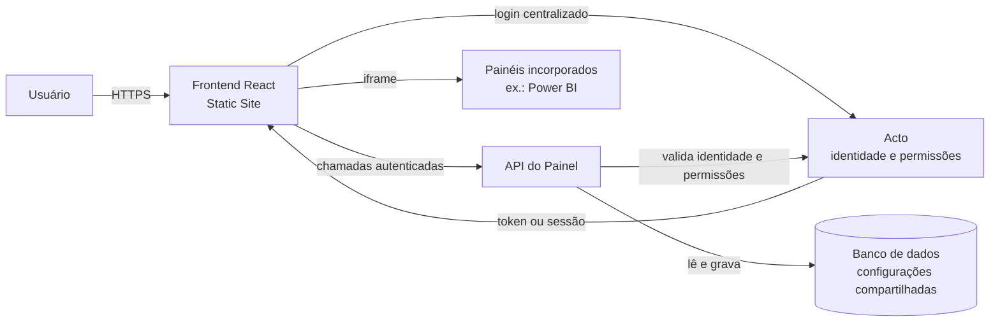
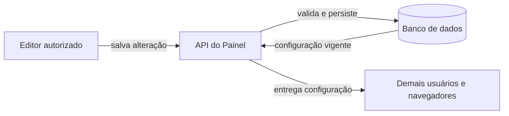
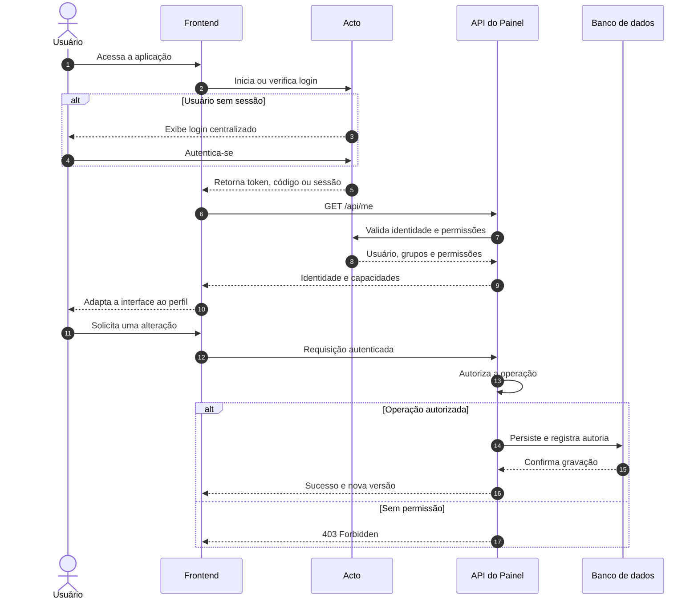
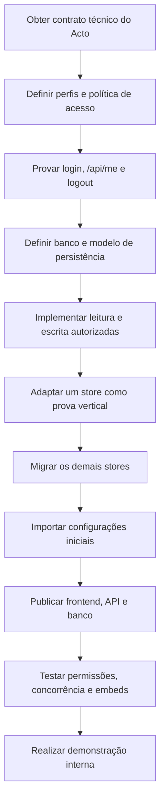

# Visão de deploy e arquitetura do MVP

## 1. Objetivo

Disponibilizar o Painel de Governo para demonstração interna em uma URL compartilhada, com:

- baixo custo operacional;
- publicação simples e automatizada;
- configurações compartilhadas entre todos os usuários;
- autenticação e permissões herdadas do Acto;
- uma base que possa evoluir sem transformar o MVP prematuramente em uma infraestrutura complexa.

O frontend atual é uma aplicação React/Vite. Seu build gera arquivos estáticos na pasta `dist`; portanto, não é necessário manter um servidor Node apenas para entregar a interface.

## 2. Arquitetura proposta



### Responsabilidades

| Componente | Responsabilidade |
| --- | --- |
| Frontend React | Navegação, visualização, formulários administrativos e apresentação das permissões recebidas. |
| Acto | Fonte central de identidade, login, grupos, estruturas organizacionais e permissões. |
| API do Painel | Autoriza operações, valida os dados e controla leitura e gravação. |
| Banco de dados | Persiste painéis, lentes, coleções, configurações e dados de auditoria. |
| Provedor de hospedagem | Entrega o frontend e executa a API em HTTPS. |

## 3. Deploy do frontend

Para a demonstração interna, a opção de menor atrito é publicar o frontend como **Static Site no Render**, aproveitando a experiência anterior da equipe com a plataforma.

Configuração sugerida:

| Campo | Valor |
| --- | --- |
| Tipo de serviço | Static Site |
| Build command | `npm ci && npm run build` |
| Publish directory | `dist` |
| Node.js | Versão compatível com o campo `engines` do `package.json` |
| Auto-deploy | Branch escolhida para a demonstração |

Como a aplicação utiliza roteamento no cliente, o host deverá redirecionar rotas desconhecidas para `index.html`:

```text
/*  /index.html  200
```

Esse rewrite evita respostas 404 ao abrir diretamente rotas como `/admin`, `/catalogo` ou uma coleção específica.

Para o MVP, Docker não é necessário para o frontend.

## 4. Persistência compartilhada

Na versão atual, configurações administrativas mantidas no navegador não são automaticamente compartilhadas. Cada navegador possui seu próprio armazenamento local, que também pode ser perdido quando os dados de navegação forem apagados.

Para que uma alteração seja vista por todos que acessarem a URL, os stores locais deverão ser substituídos por uma fonte central:



O `localStorage` pode continuar sendo usado somente para preferências individuais, por exemplo:

- tema visual;
- última seção visitada;
- preferências de exibição que não devam afetar outros usuários.

### Modelo inicial

Para uma prova de conceito muito curta, toda a configuração poderia ser armazenada como um documento JSON versionado:

```text
app_config
- id
- data
- version
- updated_at
- updated_by
```

Entretanto, se o MVP já for a base da futura aplicação, é preferível separar as entidades:

- `panels`;
- `lenses`;
- `collections`;
- `settings`;
- `config_revisions` ou outro registro de auditoria.

Todos os registros editáveis devem possuir, no mínimo:

- identificador estável;
- data de criação e alteração;
- identidade de quem criou e alterou;
- versão para detecção de atualizações concorrentes.

No primeiro estágio, pode ser adotada a regra de "última gravação vence". O campo de versão permite evoluir posteriormente para alertas ou bloqueios quando duas pessoas editarem o mesmo item.

## 5. Autenticação centralizada pelo Acto

O Painel de Governo não deverá criar um cadastro ou login independente. O Acto será a autoridade de identidade e permissões.

### Fluxo esperado

1. O usuário acessa o Painel de Governo.
2. A aplicação verifica se existe uma sessão válida no Acto.
3. Sem sessão, o usuário é redirecionado ao login centralizado.
4. Após o login, a aplicação recebe uma sessão ou credencial temporária conforme o protocolo oferecido pelo Acto.
5. O frontend consulta a API do Painel, por exemplo em `/api/me`.
6. A API valida a identidade e obtém ou interpreta as permissões fornecidas pelo Acto.
7. O frontend adapta a interface ao perfil retornado.
8. A cada operação protegida, a API volta a verificar a permissão antes de ler ou gravar dados.



A interface pode ocultar ou desabilitar ações sem permissão, mas isso serve apenas para experiência do usuário. A autorização efetiva deve sempre ocorrer na API.

### Integração preferencial

Se o Acto oferecer OAuth 2.0 ou OpenID Connect, o fluxo preferencial é Authorization Code com PKCE ou um fluxo equivalente recomendado pelo provedor. As credenciais do usuário permanecem exclusivamente no Acto e nunca passam pelo Painel de Governo.

Se o Acto expuser somente uma sessão baseada em cookie, será necessário validar cuidadosamente:

- compartilhamento da sessão entre domínios;
- atributos `SameSite`, `Secure` e `HttpOnly`;
- regras de CORS;
- proteção contra CSRF;
- disponibilidade de um endpoint que identifique a sessão atual.

Hospedar os componentes em subdomínios institucionais relacionados pode simplificar esse cenário, sujeito às regras de infraestrutura e segurança:

```text
acto.exemplo.gov.br
paineis.exemplo.gov.br
api-paineis.exemplo.gov.br
```

### Autorização

As permissões devem preferencialmente vir do Acto. Caso os nomes ou a granularidade não coincidam com as operações do Painel, a API manterá um mapeamento, e não um segundo cadastro de usuários.

Exemplo conceitual:

| Perfil ou grupo no Acto | Capacidades no Painel |
| --- | --- |
| Administrador | Administrar e publicar configurações |
| Editor | Criar e editar rascunhos |
| Leitor | Visualizar conteúdo autorizado |
| Operador de kiosk | Abrir apresentações destinadas a telões |

Possíveis permissões funcionais:

```text
painel.visualizar
painel.administrar
painel.publicar
colecao.administrar
kiosk.visualizar
```

Esses nomes são ilustrativos e dependem do contrato real do Acto.

## 6. API do Painel

Mesmo que o banco escolhido ofereça uma API direta para navegadores, as operações administrativas devem passar por uma API controlada pelo projeto. Essa camada é necessária para aplicar de forma confiável as permissões herdadas do Acto.

Responsabilidades mínimas:

- validar tokens ou sessões do Acto;
- fornecer a identidade e as capacidades do usuário atual;
- autorizar cada leitura ou escrita protegida;
- validar payloads com os mesmos contratos de domínio usados pelo frontend;
- persistir configurações;
- registrar autoria, horário e tipo das alterações;
- rejeitar versões desatualizadas quando o controle de concorrência for ativado.

Endpoints iniciais possíveis:

```text
GET    /api/me
GET    /api/panels
POST   /api/panels
PUT    /api/panels/:id
GET    /api/lenses
POST   /api/lenses
PUT    /api/lenses/:id
GET    /api/collections
POST   /api/collections
PUT    /api/collections/:id
GET    /api/settings
PUT    /api/settings
```

A lista definitiva deve nascer das operações efetivamente suportadas pela interface, evitando criar uma API maior que o MVP.

## 7. Banco de dados

PostgreSQL é uma opção adequada para a persistência compartilhada. Ele pode ser contratado diretamente no provedor escolhido ou por meio de uma plataforma gerenciada.

Caso o Supabase seja utilizado como PostgreSQL gerenciado, sua autenticação não será a fonte de identidade: esse papel continuará pertencendo ao Acto. Para as operações administrativas, o frontend não deverá receber uma credencial privilegiada de banco nem contornar a API do Painel.

Segredos de banco, chaves administrativas e credenciais de integração devem existir apenas no ambiente da API. Variáveis `VITE_*` fazem parte do bundle entregue ao navegador e, portanto, nunca devem conter segredos.

## 8. Painéis incorporados

O deploy deve ser testado com todos os provedores de conteúdo incorporado. Uma URL funcionar em uma aba normal não garante que funcionará em um `iframe`.

Devem ser verificados:

- HTTPS em todas as origens;
- `Content-Security-Policy`, especialmente `frame-ancestors`;
- `X-Frame-Options`;
- cookies de terceiros e restrições do navegador;
- fluxo de login e MFA dentro do `iframe`;
- regras de RLS/OLS dos relatórios;
- sessão persistente e renovação de credenciais no modo kiosk.

A autenticação no Acto não substitui automaticamente a autenticação exigida por um Power BI Secure Embed. São sessões e autoridades distintas, salvo se existir uma integração institucional específica entre elas.

## 9. Requisitos a confirmar com a equipe do Acto

Antes de implementar a integração, é necessário obter um contrato técnico contendo:

- protocolo utilizado: OAuth 2.0, OpenID Connect, JWT, cookie de sessão ou mecanismo proprietário;
- URLs de autorização, token, logout e dados do usuário;
- mecanismo de validação: assinatura local, JWKS, introspecção ou consulta à API;
- claims ou campos que identificam usuário, órgão, grupos e permissões;
- validade, renovação e revogação da sessão;
- URLs de callback e origens permitidas;
- regras de CORS, cookies e CSRF;
- comportamento de logout único;
- ambientes de desenvolvimento, homologação e produção;
- procedimento para cadastro desta aplicação como cliente;
- tratamento de contas técnicas ou dispositivos kiosk;
- limites de chamadas, disponibilidade esperada e tratamento de indisponibilidade;
- responsável técnico pela integração.

Também deve ser decidido se a consulta de permissões acontecerá a cada requisição ou se a API poderá mantê-las em cache por um período curto. O cache reduz dependência operacional, mas aumenta o tempo até uma revogação produzir efeito.

## 10. Escopo recomendado para a demonstração

### Incluir

- frontend publicado como site estático;
- API pequena e autenticada;
- configuração compartilhada em PostgreSQL;
- login centralizado no Acto;
- leitura conforme a política definida para o público interno;
- escrita restrita aos perfis autorizados;
- registro de `created_by`, `updated_by`, `created_at` e `updated_at`;
- logs de erros e verificadores básicos de disponibilidade;
- dados fictícios, públicos ou devidamente autorizados.

### Adiar, salvo necessidade da demonstração

- workflow completo de aprovação editorial;
- histórico visual e restauração avançada;
- permissões extremamente granulares por campo;
- colaboração em tempo real;
- filas e processamento assíncrono;
- arquitetura de microsserviços;
- Docker ou orquestração para o frontend estático.

## 11. Etapas de implementação



1. Obter e validar o contrato de autenticação e permissões do Acto.
2. Definir quais telas exigem login e quais dados podem ser lidos por cada perfil.
3. Escolher o banco PostgreSQL e o ambiente de hospedagem da API.
4. Implementar uma prova de integração com o Acto, incluindo login, `/api/me` e logout.
5. Definir o modelo inicial de persistência e criar as migrações.
6. Implementar na API uma primeira operação completa de leitura e escrita autorizada.
7. Criar um `DataProvider` remoto e adaptar um store administrativo como prova vertical.
8. Migrar os demais stores de painéis, lentes, coleções e configurações.
9. Importar os dados iniciais atualmente versionados no projeto.
10. Configurar o Static Site, a API, variáveis de ambiente e o rewrite de SPA.
11. Testar autenticação, autorização, concorrência e embeds no endereço HTTPS real.
12. Realizar a demonstração com contas representando cada perfil relevante.

## 12. Decisões iniciais

| Tema | Direção inicial |
| --- | --- |
| Entrega do frontend | Static Site |
| Hospedagem candidata | Render |
| Persistência | PostgreSQL compartilhado |
| Identidade | Acto |
| Autorização | Permissões do Acto aplicadas pela API do Painel |
| Segredos | Somente no ambiente da API |
| Preferências pessoais | Podem permanecer no `localStorage` |
| Configurações globais | Devem ser persistidas no banco |
| Concorrência inicial | Última gravação vence, com campo de versão preparado |
| Auditoria mínima | Autor e horário de criação/alteração |

## 13. Critérios de sucesso do MVP

O MVP de deploy estará pronto para demonstração quando:

- a aplicação puder ser acessada por uma URL HTTPS estável;
- rotas internas funcionarem também quando abertas diretamente;
- o login ocorrer por meio do Acto, sem cadastro duplicado;
- a API identificar o usuário e suas permissões;
- um usuário autorizado puder alterar uma configuração;
- a alteração puder ser vista por outro usuário ou navegador;
- um usuário sem permissão não conseguir alterar dados, inclusive por chamada direta à API;
- a autoria da alteração ficar registrada;
- os embeds prioritários funcionarem no domínio publicado;
- nenhum segredo estiver exposto no bundle do frontend.

## 14. Riscos principais

| Risco | Mitigação inicial |
| --- | --- |
| Contrato do Acto insuficiente ou indisponível | Fazer uma prova técnica da autenticação antes de migrar todos os stores. |
| Permissões aplicadas somente na interface | Centralizar toda autorização efetiva na API. |
| Configurações sobrescritas por edições concorrentes | Manter `version` e evoluir para controle otimista. |
| Segredos expostos no Vite | Nunca colocar segredos em variáveis `VITE_*`; mantê-los na API. |
| Embed bloqueado no domínio publicado | Validar CSP, cookies e autenticação no ambiente HTTPS antes da demonstração. |
| Indisponibilidade do Acto impedir acesso | Definir timeout, mensagem de erro, política de cache e comportamento de contingência. |
| URL de demonstração expor dados internos | Usar dados autorizados e aplicar autenticação também à leitura quando necessário. |

---

Este documento registra uma direção de arquitetura, não um contrato definitivo. A escolha do fluxo de login, do modelo de permissões e da topologia de domínios depende da documentação técnica e das regras de infraestrutura do Acto.
